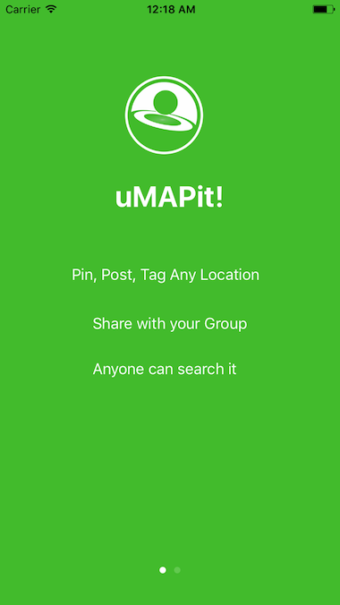

# uMAPit iOS App

Please see the [website](http://www.umapit.co) to get an idea about this app.

## How to run

- This app is using cocoapods dependency manager. Go to the root folder of the app and run `$ pod install`
- Open `uMAPit.xcworkspace` and Run the project! 

## Open source Libraries used

- Alamofire
- SwiftJSON
- Realm Swift
- Kingfisher

# Screenshots

## TODO

- Implement Registration View Controller
- Implement Profile View and Feed View Controllers
- Implement New Post View Controller
- Implement Search View Controller
- Implement Google Maps View Controller